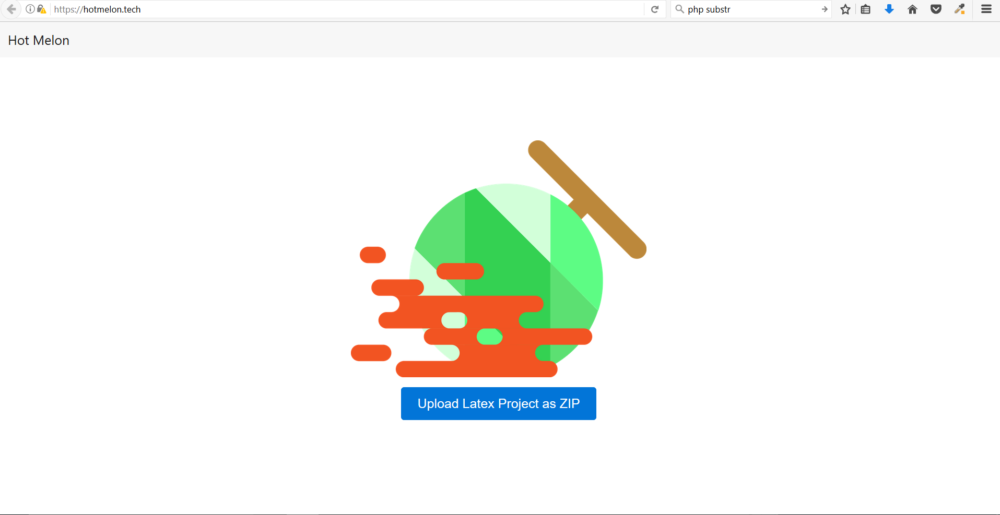
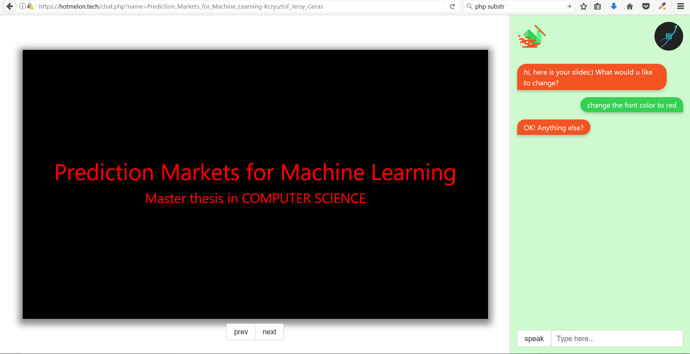

# hotmelon
This is a hackathon project hosted on .tech domain using AWS -- Angelhack 2017 (http://angelhack.com) 
One of the most disturbing thing for a student may be how to make a fancy Slide for presentation. Our project aims at reducing the pain, transforming an academic paper into a wonderful slide automatically.  
It incorporates NLP to process the paper, an interactive voice-commanded chat box to style it, and leverage Slide API from google to generate slides.   

## Demo 
### Screenshots
 

### Video
[link to youtube demo video](https://youtu.be/qmN0nTwWL8w) 

## source code: 
* open source library: markdown to google slides: `http://github.com/json2markdown.py`
* main server built with php: `https://github.com/danvim/hotmelon.git`
* extract data to present on google slides from articles: `https://github.com/pyliaorachel/hotmelon-parser` 
* another server for integrating api.ai: `https://hotmelon.herokuapp.com`
